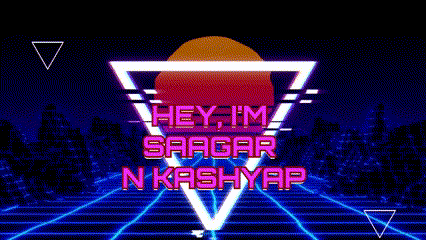

  

&nbsp;

# Hi, I'm Saagar N Kashyap

A person who plays with data and explores where logic meets humanity. I build systems that think, reflect, and sometimes even feel. From analyzing dementia data to scripting meaning from ancient scriptures, I love riding through code and cognition.

---

## Current Project

Working on **Dementia Prediction and Analysis** — a deep learning approach to helping families and caregivers detect cognitive decline early and accurately.

---

## Let's Collaborate

I’m looking for collaborators on **Bheeshma** – a digital Gita companion combining NLP and visual storytelling.

Check out my work: [🔗 GitHub Repos](https://github.com/saagarnkashyap?tab=repositories)

Reach me at: **saagarcourses@gmail.com**

Fun fact: *Beyond code, I write poetry, edit music, and see life as data infused with meaning.*

---

## My Toolbox

 &nbsp;
 &nbsp;
 &nbsp;
 &nbsp;
 &nbsp;
 &nbsp;
 &nbsp;
 &nbsp;
 &nbsp;
 &nbsp;
 &nbsp;
 &nbsp;

---

## GitHub Stats

---

## Leetcode Stats

## Blog Posts (Coming Soon)
<!-- BLOG-POST-LIST:START -->
<!-- BLOG-POST-LIST:END -->
